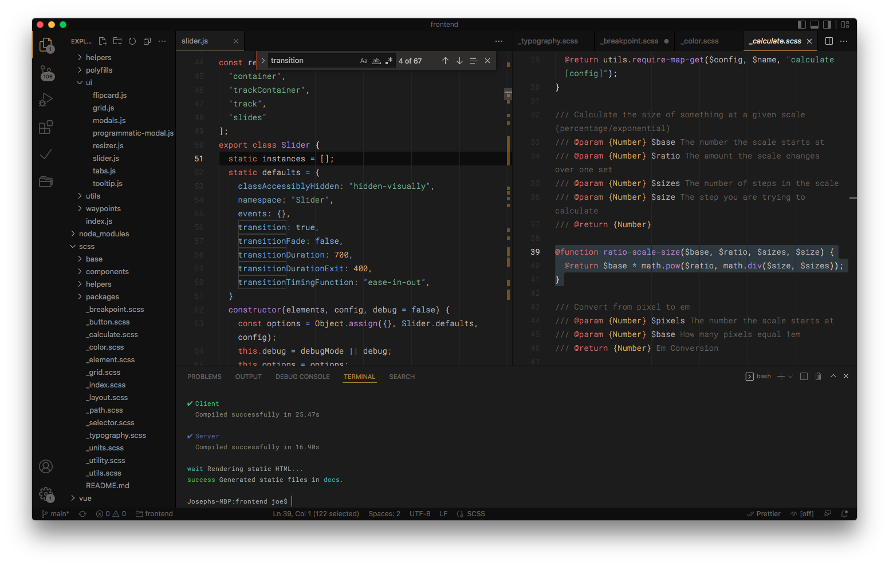
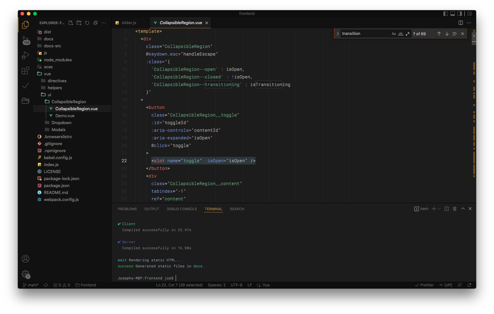

# Tinted

**A minimal dark color theme designed to reduce eye strain and focus on readability.**

- Monotone UI
- Tinted color palette
- Designed to reduce eye train 
- Focus on readability
- Reduced contrast between different colors in syntax highlighting
- Works well on monitors of varying quality
- Day or night (low light)
- Balanced color weights

## Previews

*The font in the screenshots below is [Roboto Mono Light](https://fonts.google.com/specimen/Roboto+Mono)*.

**Javascript Example**

## Languages Tested

- Javascript
- Markdown
- Sass
- Less
- CSS
- HTML
- JSON
- YAML
- PHP
- Vue (SFC)

## Issues 

If you see an issues or something that doesn't look correct, please feel free to open an issue on [Github](https://github.com/Jscherbe/vscode-theme-tinted/issues).