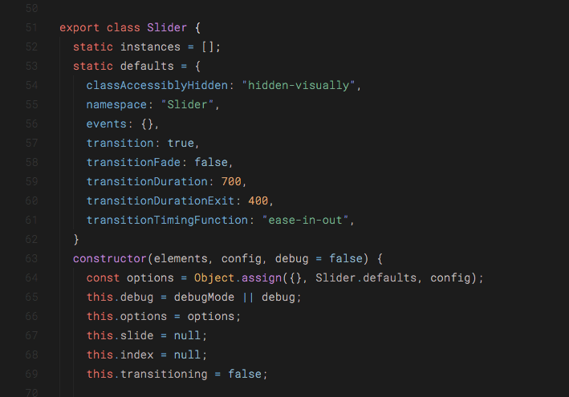

# Tinted

A minimal dark color theme designed to reduce eye strain and focus on readability.

- Monotone UI
- Tinted Color Palette
- Designed to reduce eye strain
- Focus on readability
- Reduced contrast between different colors syntax highlighting
- Balanced color weights

